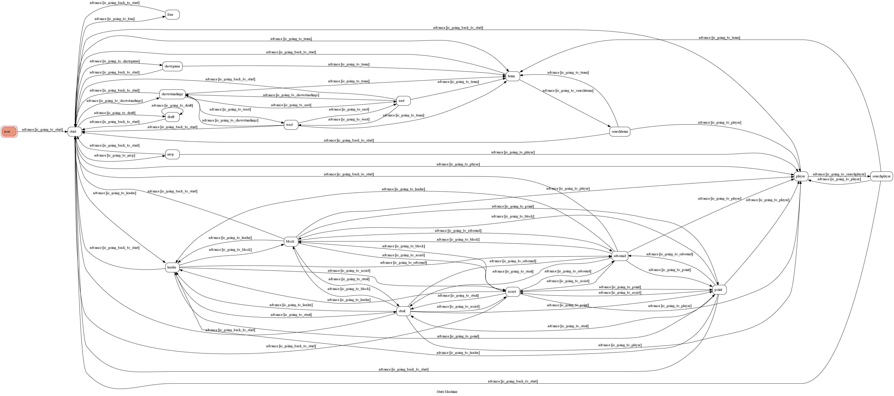

# TOC Project 2022

TOC Project 2022

A Line bot based on a finite state machine

More details in the [Slides](https://hackmd.io/@TTW/ToC-2019-Project#) and [FAQ](https://hackmd.io/s/B1Xw7E8kN)
## Creation
Due to the inconvenience of searching nba database in [NBA.com](https://www.nba.com), I create this line bot for the person who doesn't want to watch games, but is interesting in the **games**, **players**, **teams**, even **draft**. 

There are more than **7 types** of features that you can play with.

So, enjoy the show that the line bot brings with!

## Information

**Add Line Friend:**

## Menu

* This menu is composed of **4 pages** that you can choose to search.
* Or, you can just type the word and get the **nba information** that you want.

## NBA Todays

### Watch games
* For the first feature, we can search for todays nba games,  also the points and the teams' names will be find and list to you.

### MVPs
* For todays the **most valuable** players, we can also use this bot to do the task, and find out who scores **the highest** in the games.

### Analysis
* We can do the analysis for **the whole nba league**, and find out who is in the first place, who is in the last.

#### West Conference
* Searching for west conference teams rank

#### East Conference
* Searching for east conference teams rank

## Searcing Option

### Players List
* This feature can help you search for you favorite nba player, also you can touch the icon to get the player information on basketball-reference.com.

* Note that you should type **the correct** nba player name! 
* Otherwise, you will encounter the following message!

### Teams List
* This feature can help you find your favorite team in the league (**total 30 teams**), and also, you can touch on the icon to get team information on [basketball-reference.com](https://www.basketball-reference.com).

* Note that you should type **the correct** nba team name! 
* Otherwise, you will encounter the following message!

### Leaders in NBA
* Calling the `leader` , you will get five genre of leading records **in this nba season**, and this record will **vary** when the ranking changes. (**from the latest reference**)

**Following are the five genre of leadings:**
#### Points Leader
* Top 3 players in the **points** field
* Show the points for each **top 3**!

#### Rebound Leader
* Top 3 players in the **rebounds** field
* Show the rebounds for each **top 3**!

#### Assist Leader
* Top 3 players in the **assists** field
* Show the assists for each **top 3**!

#### Steal Leader
* Top 3 players in the **steals** field
* Show the steals for each **top 3**!

#### Block Leader
* Top 3 players in the **blocks** field
* Show the blocks for each **top 3**!

## Draft Mocking
* This feature can also give you the brand new experience of new nba season **draft mocking**.
* When you start mocking the draft, It will list the **top 3 draft picks** in simulation.
* Also, it will list the **overall rating** and **the teams' picks** for each draftees!

### Draft Result
* Followings are three different draftees and **their corresponding teams, overalls**.
#### 1'st draft

#### 2'st draft

#### 3'st draft

## Show FSM Diagram
* This button **FSM** show the **finite state machine diagram** for **nba searching linebot**.

* Call `fsm` to get diagram.
* Using imgur.com to store my image and represent as an **api** to send message.

## Finite State Machine

## Bonus
* Using Web crawler to do searching in this line bot.
* Using imgur.com to create an api for sending image FSM.
* Supplying the service to multipe Line accounts at the same time.
* Web crawling website:
  * [basketball-reference.com](https://www.basketball-reference.com)
  * [nbadraft.net](https://www.nbadraft.net)

## Reference
[Pipenv](https://medium.com/@chihsuan/pipenv-更簡單-更快速的-python-套件管理工具-135a47e504f4) ❤️ [@chihsuan](https://github.com/chihsuan)

[TOC-Project-2019](https://github.com/winonecheng/TOC-Project-2019) ❤️ [@winonecheng](https://github.com/winonecheng)

Flask Architecture ❤️ [@Sirius207](https://github.com/Sirius207)

[Line line-bot-sdk-python](https://github.com/line/line-bot-sdk-python/tree/master/examples/flask-echo)
